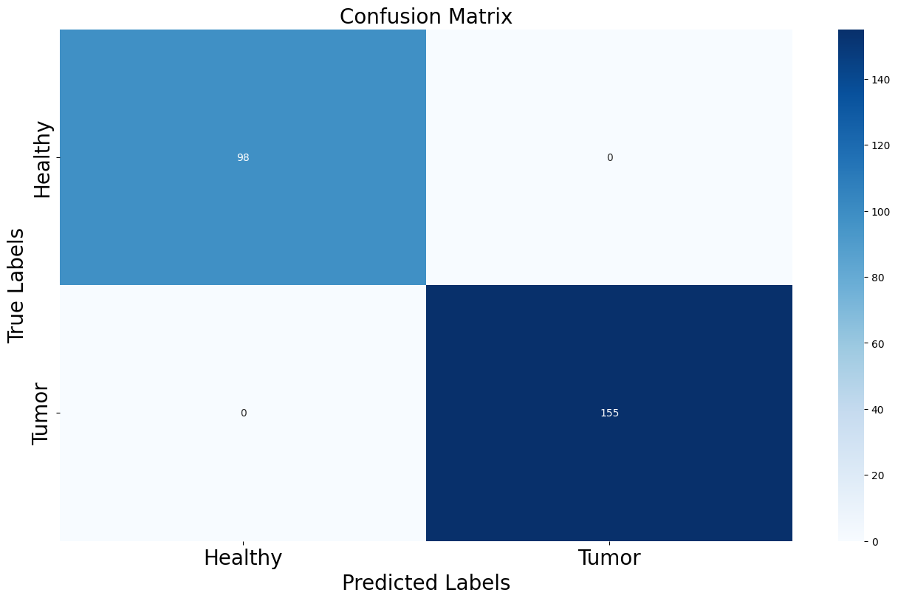
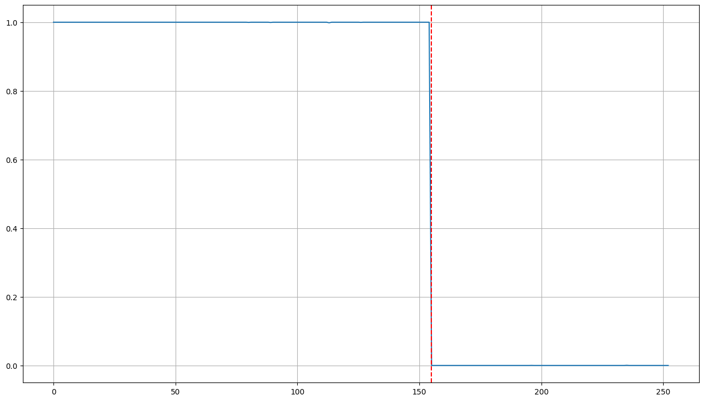

# Brain Tumor Detection with UNet Model

This project demonstrates a binary classification task to distinguish between healthy and tumor brain MRI images using a modified UNet architecture.

# Dataset
- Tumor images** are located in the `/brain_tumor_dataset/yes` directory.
- Healthy images** are located in the `/brain_tumor_dataset/no` directory.

# Model Architecture
We use a modified UNet model for this binary classification task. The model consists of:
- Encoder: Contracting path with several convolutional layers.
- Decoder: Expanding path using transpose convolutions.
- Final layer: A fully connected layer to predict healthy or tumor labels.

# Training Parameters
- Optimizer: Adam with a learning rate of 0.0001.
- Epochs: 140.
- Loss Function: Binary Cross-Entropy (BCE) loss for binary classification.

# Results
- Accuracy: Displayed after training the model using the `accuracy_score` function.
- Confusion Matrix: The performance of the model is visualized using a heatmap of the confusion matrix.

# How to Use
1. Install the required Python libraries.
2. Load the dataset and run the training script.
3. The output includes model accuracy and a confusion matrix.

# Sample Code

```python
# Instantiate the model
model = UNet_Classification().to(device)

eta = 0.0001
EPOCHS = 140
optimizer = torch.optim.Adam(model.parameters(), lr=eta)

criterion = nn.BCELoss()

# Training loop
for epoch in range(1, EPOCHS + 1):
    losses = []
    for D in dataloader:
        optimizer.zero_grad()
        data = D['image'].to(device)
        label = D['label'].to(device)
        y_hat = model(data)
        label = label.unsqueeze(1)
        loss = criterion(y_hat, label)
        loss.backward()
        optimizer.step()
        losses.append(loss.item())

```
# Visualization
Confusion Matrix: A heatmap to show the model's predictions.



Output Plot: A plot displaying the model's prediction outputs.




